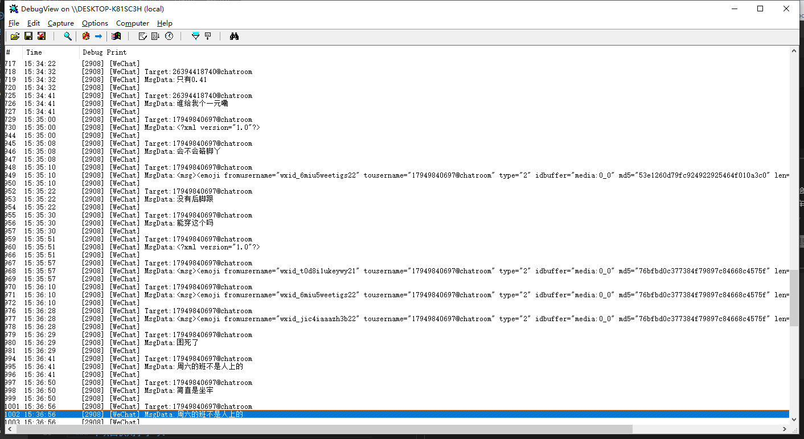

## 利用DLL劫持技术实现自动监听微信消息

```
开发工具：Visual Studio 2022
开发语言：C++(空项目)
字符集环境：多字节字符集（ASCII）
微信版本：3.9.0.28
```
---
## 实现思路：
1. 利用DLL加载机制实现启动劫持，每次运行微信都会自动加载监听文件，恶意DLL文件加载后会启动新线程，防止主线程阻塞；
2. 主线程的任务就是写Hook（科普：HOOK可以想像成道路上的监控，而微信消息就是车辆，车辆每次经过，监控就会记录）；
3. 所以程序的难点也是安装监控，Hook的手法千差万别，这里使用的是比较稳定的JMP HOOK，这里的稳定是指程序执行方面；
4. 使用什么类型的HOOK视项目而定，比如有内存CRC的，那么硬断VEH可能是较好的选择；
5. 写HOOK涉及一些内存分配、内存读写、指令跳转、堆栈平衡和补码相关知识，内容较多这里就不展开说了(其实就是造轮子，写一次以后都能用)
6. HOOK写好后就是等车辆经过，对这些消息进行处理、打印或记录．．．．
  
---
### 项目涉及的知识点：
- DLL 劫持 (参考：[AheadLib-x86-x64](https://github.com/strivexjun/AheadLib-x86-x64))
- 建立线程
- Hook编写
- 堆栈平衡
- Windows API
- 汇编处理
- 编码转换

---
## 效果图


---

- ### 本项目仅用于学习！
